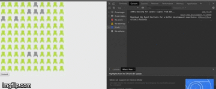

# SeatPicker
This is a component for a cinema seat picker in react

It is mostly based on React, CSS and a bit of logic...You don't need any special libraries 😊

The app was created with <i>npx create-react-app</i>

To run the application you need to download it, go in the application folder and run these commands:

<i>npm install</i>

<i>npm start</i>
